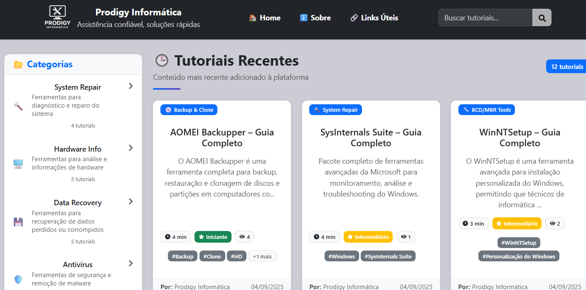

# Prodigyfix

<div align="center">
  
</div>

<p align="center">
  Plataforma criada pela <strong>Prodigy Informática</strong> para concentrar tutoriais, manuais e links úteis sobre manutenção de computadores.  
  Oferece uma interface simples para leitura de conteúdo técnico e um painel administrativo para gerenciar tutoriais e recursos.
</p>

---

## 🎥 Preview

<div align="center">
  
</div>

<p align="center">
  🔗 <a href="https://prodigyfix.vercel.app/" target="_blank" rel="noopener"><strong>➥ Live Demo</strong></a>
</p>

---

## 🚀 Tecnologias

<p align="center">
  
  
  
  
  
  
  
  
</p>

---

## ✨ Funcionalidades

- 🔐 Autenticação para administradores  
- 📝 Editor WYSIWYG (TipTap) para criação de tutoriais  
- 🔍 Busca e filtros por título ou categoria  
- 📱 Design totalmente responsivo  
- 📂 Gerenciamento de links úteis  
- 🏷️ Categorias e tags para organizar o conteúdo  
- 🖼️ Upload e exibição de imagens nos tutoriais  

---

## 🛠️ Pré-requisitos

- Node.js **16+**  
- npm ou yarn  
- Conta no **Firebase** (Firestore + Storage)

---

## 🚀 Instalação (local)

1. Clone o repositório:

```bash
git clone https://github.com/felipe-ssantos/prodigyfix.git
cd prodigyfix

---

2. Instale as dependências:

```bash
npm install
# ou
yarn install
```

3. Configure variáveis de ambiente:

```bash
cp .env.example .env
```

Crie um arquivo `.env` com suas credenciais (prefixo `VITE_`):

```env
VITE_FIREBASE_API_KEY=your_api_key
VITE_FIREBASE_AUTH_DOMAIN=your_project.firebaseapp.com
VITE_FIREBASE_PROJECT_ID=your_project_id
VITE_FIREBASE_STORAGE_BUCKET=your_project.appspot.com
VITE_FIREBASE_MESSAGING_SENDER_ID=your_sender_id
VITE_FIREBASE_APP_ID=your_app_id
```

> **Atenção**: não commit o `.env`; utilize env vars do seu host (Vercel, Netlify etc.).

4. Inicie em modo de desenvolvimento:

```bash
npm run dev
# ou
yarn dev
```

---

## 📚 Scripts úteis

| Script            | Descrição                                |
| ----------------- | ---------------------------------------- |
| `npm run dev`     | Inicia o servidor de desenvolvimento     |
| `npm run build`   | Gera a versão de produção                |
| `npm run preview` | Visualiza a build de produção localmente |
| `npm run lint`    | Executa o linter (se configurado)        |

---

## 🧩 Notas

- Verifique se as imagens (`logo_fundo_branco.png` e `Index.png`) estão no caminho `src/assets/` com nomes e capitalização exatos.

- Para o preview no README, você pode usar uma imagem menor (ex.: `width="800"`) ou otimizá-la.

---

## 🤝 Contribuindo

1. Faça um `fork` deste repositório

2. Crie uma branch:
   
   ```bash
   git checkout -b feature/nome-da-feature
   ```

3. Faça commits claros:
   
   ```bash
   git commit -m "feat: descrição da feature"
   ```

4. Faça push:
   
   ```bash
   git push origin feature/nome-da-feature
   ```

5. Abra um **Pull Request**

---

## 📝 Licença

Projeto sob licença **MIT**. Veja o arquivo [LICENSE](https://chatgpt.com/c/LICENSE) para detalhes.

---